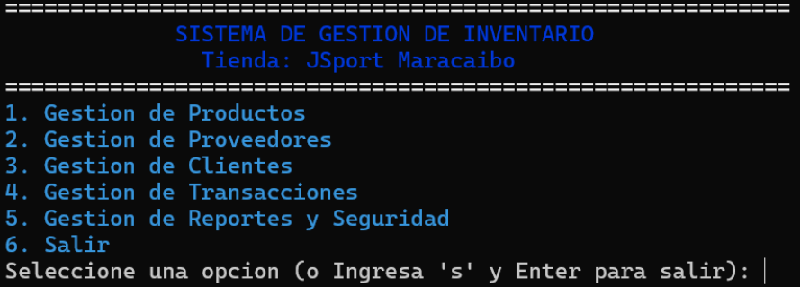
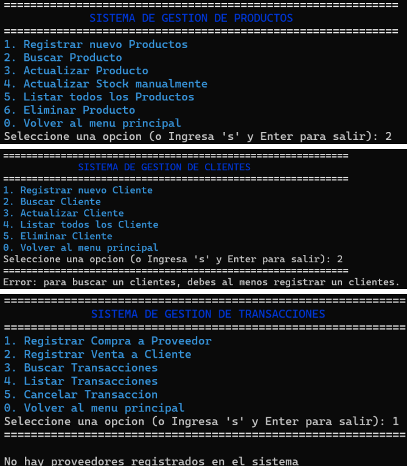
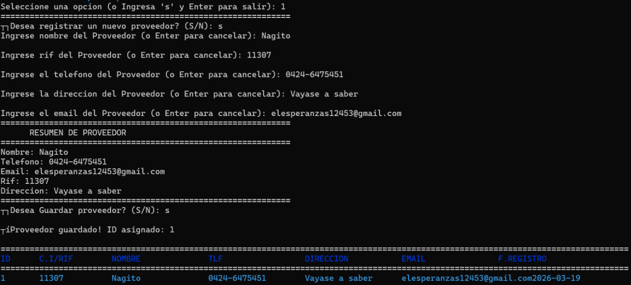
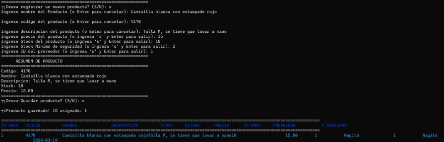
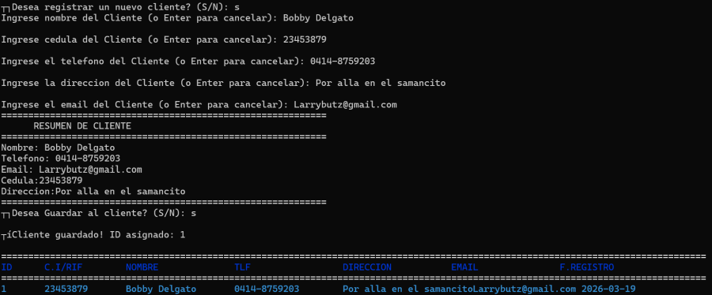
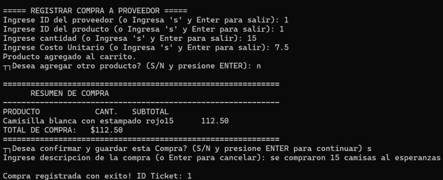
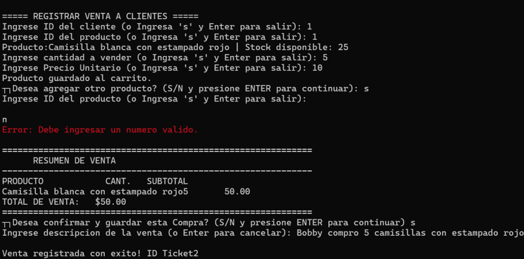

# 👟 Sistema de Gestión de Inventario y Ventas para la Tienda Jsport 🎽🏀

## 📝 Descripción del Proyecto
**C++** **JSport Maracaibo** es una solución de software desarrollada en C++ para la gestión integral de inventarios, ventas y relaciones con proveedores. El sistema destaca por su manejo avanzado de **persistencia en archivos binarios** y un motor de **integridad referencial** que asegura la consistencia de los datos.

---

## 🚀 Características Principales

### 📦 Gestión de Productos e Inventario
- **CRUD Completo:** Registro, búsqueda, actualización y borrado lógico de productos.
- **Stock Crítico:** Sistema de alertas visuales (ANSI Colors) para productos por debajo del stock mínimo.
- **Truncado Inteligente:** Interfaz de usuario limpia con truncado automático de descripciones largas para mantener la alineación de tablas.

### 🛡️ Seguridad y Mantenimiento
- **Módulo de Backup:** Creación dinámica de carpetas por fecha y hora para respaldos de seguridad.
- **Integridad Referencial:** Motor de diagnóstico que valida relaciones entre productos, proveedores y transacciones.
- **Borrado Lógico:** Los registros no se pierden, se marcan para mantener el historial transaccional.

### 📊 Transacciones y Reportes
- Registro detallado de compras y ventas.
- Historial dinámico de clientes y proveedores.
- Estadísticas de ventas acumuladas.

---

## 🛠️ Detalles Técnicos (Ingeniería de Software)

Este proyecto implementa conceptos avanzados de programación estructurada y manejo de memoria:

* **Persistencia de Datos:** Uso de la librería `fstream` para manipulación eficiente de archivos binarios `.bin`, permitiendo un acceso rápido y estructurado a la información.
* **Headers de Control:** Cada archivo binario inicia con un `struct ArchivoHeader` que gestiona la cantidad de registros activos y el próximo ID disponible.
* **Interfaz de Usuario (CLI):** Implementación de secuencias de escape ANSI para una jerarquía visual clara mediante colores, facilitando la distinción entre mensajes de error, éxito y alertas de stock. Uso de `SetConsoleOutputCP(CP_UTF8)` para soporte de caracteres especiales en Windows.
* **Gestión de Directorios:** Integración con la API de Windows (`_mkdir`) para la organización de archivos de respaldo.

---

## ⚙️ Instalación y Ejecución

Sigue estos pasos para configurar y ejecutar el sistema en tu entorno local:

### 1. Requisitos Previos
*   **Compilador C++:** Se recomienda `GCC` (MinGW para Windows) o cualquier compilador compatible con el estándar C++11 o superior.
*   **Terminal:** Para una visualización correcta de los colores, utiliza **PowerShell**, **Windows Terminal** o una consola compatible con secuencias de escape ANSI.

### 2. Clonar el Repositorio
Abre tu terminal y ejecuta el siguiente comando:
```cpp
git clone [https://github.com/Vaneppv/ProyectPerez_Novoa.git](https://github.com/Vaneppv/ProyectPerez_Novoa.git)
cd ProyectPerez_Novoa
```
---

## 🧠 Lógica de Persistencia y Archivos

El núcleo de **Tienda JSport** se basa en la manipulación directa de archivos binarios, lo que garantiza que los datos se mantengan entre sesiones de ejecución.

### 📑 Estructura de Datos
A diferencia de los archivos de texto planos, utilizamos `structs` de tamaño fijo. Esto permite:
* **Acceso Aleatorio:** Calcular la posición exacta de un registro en el archivo usando `sizeof(Entidad) * indice`.
* **Eficiencia de Almacenamiento:** Menor peso en disco y mayor velocidad de lectura/escritura.

### 📂 Gestión de Archivos Binarios
Implementamos un flujo de trabajo de "Búsqueda y Modificación":
1. Se abre el archivo en modo `rb+` (lectura y escritura binaria).
2. Se utiliza `seekp` y `seekg` para mover el puntero del archivo a la posición deseada.
3. Se sobrescribe únicamente el registro modificado, optimizando el uso de recursos.

### 🛡️ Integridad de Datos
El sistema incluye funciones de validación para evitar inconsistencias:
* **Validación de Existencia:** Antes de registrar una venta o compra, el sistema verifica que el ID del producto y del proveedor existan en sus respectivos archivos `.bin`.
* **Control de Stock:** Algoritmos que restan o suman cantidades al inventario en tiempo real tras cada transacción validada.

---

## 📖 Lecciones Aprendidas

Durante el desarrollo de este proyecto, se fortalecieron conceptos de:
1. **Manejo de Flujos (Streams):** Control total de `fstream` para evitar la corrupción de datos.
2. **Diseño de Interfaces en Consola:** Uso de colores ANSI para mejorar la UX (User Experience).

---

## Captions

**Dashboard del Sistema - Interfaz de Navegación Principal**



**Submenus**



**Registros**




